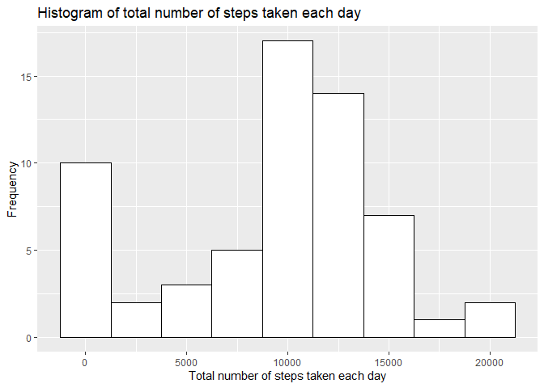
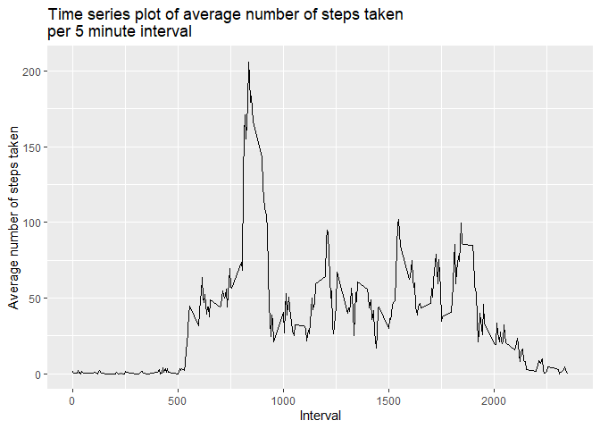
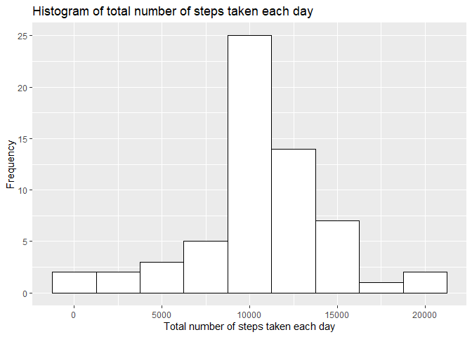
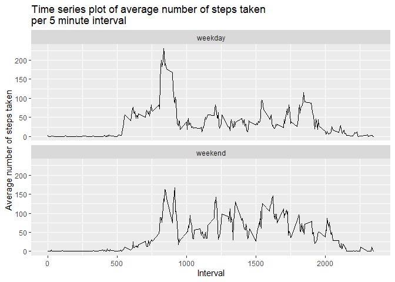

## Loading and preprocessing the data

1. Load the data.


```r
# Load libraries.
library(lubridate)
```

```
## 
## Attaching package: 'lubridate'
```

```
## The following objects are masked from 'package:base':
## 
##     date, intersect, setdiff, union
```

```r
library(dplyr)
```

```
## 
## Attaching package: 'dplyr'
```

```
## The following objects are masked from 'package:lubridate':
## 
##     intersect, setdiff, union
```

```
## The following objects are masked from 'package:stats':
## 
##     filter, lag
```

```
## The following objects are masked from 'package:base':
## 
##     intersect, setdiff, setequal, union
```

```r
library(ggplot2)

# Unzip .zip file.
if (!file.exists("activity.csv")) {
  unzip(zipfile = "activity.zip", exdir = ".")
}

# Read .csv file.
activity <- read.csv("activity.csv", stringsAsFactors = FALSE)
```

2. Process/transform the data (if necessary) into a format suitable for your analysis.


```r
# Convert to Date object.
activity$date <- ymd(activity$date)
```

## What is mean total number of steps taken per day?

1. Calculate the total number of steps taken per day.


```r
steps.total <- activity %>% 
  group_by(date) %>%
  summarize(steps = sum(steps, na.rm = TRUE))
```

2. If you do not understand the difference between a histogram and a barplot, research the difference between them. Make a histogram of the total number of steps taken each day.


```r
ggplot(steps.total, aes(steps)) +
  geom_histogram(binwidth = 2500, color = "black", fill = "white") + 
  ggtitle("Histogram of total number of steps taken each day") +
  xlab("Total number of steps taken each day") +
  ylab("Frequency")
```

<!-- -->

3. Calculate and report the mean and median of the total number of steps taken per day.


```r
mean(steps.total$steps)
```

```
## [1] 9354.23
```

```r
median(steps.total$steps)
```

```
## [1] 10395
```

## What is the average daily activity pattern?

1. Make a time series plot  of the 5-minute interval (x-axis) and the average number of steps taken, averaged across all days (y-axis).


```r
# Calculate the average number of steps per 5 minute interval.
steps.average <- activity %>% 
  group_by(interval) %>%
  summarize(steps = mean(steps, na.rm = TRUE))

# Make a time series plot.
ggplot(steps.average, aes(interval, steps)) +
  geom_line() + 
  ggtitle("Time series plot of average number of steps taken\nper 5 minute interval") +
  xlab("Interval") +
  ylab("Average number of steps taken")
```

<!-- -->

2. Which 5-minute interval, on average across all the days in the dataset, contains the maximum number of steps?


```r
steps.average$interval[which.max(steps.average$steps)]
```

```
## [1] 835
```

## Imputing missing values

1. Calculate and report the total number of missing values in the dataset (i.e. the total number of rows with NAs).


```r
sum(is.na(activity$steps))
```

```
## [1] 2304
```

2. Devise a strategy for filling in all of the missing values in the dataset. The strategy does not need to be sophisticated. For example, you could use the mean/median for that day, or the mean for that 5-minute interval, etc.

We will use the mean for that 5 minute interval.  

3. Create a new dataset that is equal to the original dataset but with the missing data filled in.


```r
activity.new <- activity
for (i in 1:length(activity.new$steps)) {
  if (is.na(activity.new$steps[i])) {
    activity.new$steps[i] <- 
      steps.average$steps[steps.average$interval == activity.new$interval[i]]
  }
}
```

4. Make a histogram of the total number of steps taken each day and calculate and report the mean and median total number of steps taken per day. Do these values differ from the estimates from the first part of the assignment? What is the impact of imputing missing data on the estimates of the total daily number of steps?


```r
# Calculate the total number of steps taken per day.
steps.total.new <- activity.new %>% 
  group_by(date) %>%
  summarize(steps = sum(steps, na.rm = TRUE))

# Make a histogram of the total number of steps taken each day.
ggplot(steps.total.new, aes(steps)) +
  geom_histogram(binwidth = 2500, color = "black", fill = "white") + 
  ggtitle("Histogram of total number of steps taken each day") +
  xlab("Total number of steps taken each day") +
  ylab("Frequency")
```

<!-- -->

```r
# Calculate the mean and median of the total number of steps taken per day
# Missing values not imputed
mean(steps.total$steps)
```

```
## [1] 9354.23
```

```r
median(steps.total$steps)
```

```
## [1] 10395
```

```r
# Missing values imputed
mean(steps.total.new$steps)
```

```
## [1] 10766.19
```

```r
median(steps.total.new$steps)
```

```
## [1] 10766.19
```

Imputing missing values increases the mean and median of the total number of steps taken per day.  

## Are there differences in activity patterns between weekdays and weekends?

1. Create a new factor variable in the dataset with two levels – “weekday” and “weekend” indicating whether a given date is a weekday or weekend day.


```r
activity.new$weekday <- factor(weekdays(activity.new$date), levels = c("Monday", "Tuesday", "Wednesday", "Thursday", "Friday", "Saturday", "Sunday"), labels = c("weekday", "weekday", "weekday", "weekday", "weekday", "weekend", "weekend"))
```

2. Make a panel plot containing a time series plot of the 5-minute interval (x-axis) and the average number of steps taken, averaged across all weekday days or weekend days (y-axis). See the README file in the GitHub repository to see an example of what this plot should look like using simulated data.


```r
# Calculate the average number of steps per 5 minute interval.
steps.average.new <- activity.new %>% 
  group_by(interval, weekday) %>%
  summarize(steps = mean(steps, na.rm = TRUE)) %>%
  ungroup()

# Make a panel plot.
ggplot(steps.average.new, aes(interval, steps)) +
  geom_line() + 
  facet_wrap(~ weekday, ncol = 1) +
  ggtitle("Time series plot of average number of steps taken\nper 5 minute interval") +
  xlab("Interval") +
  ylab("Average number of steps taken")
```

<!-- -->
